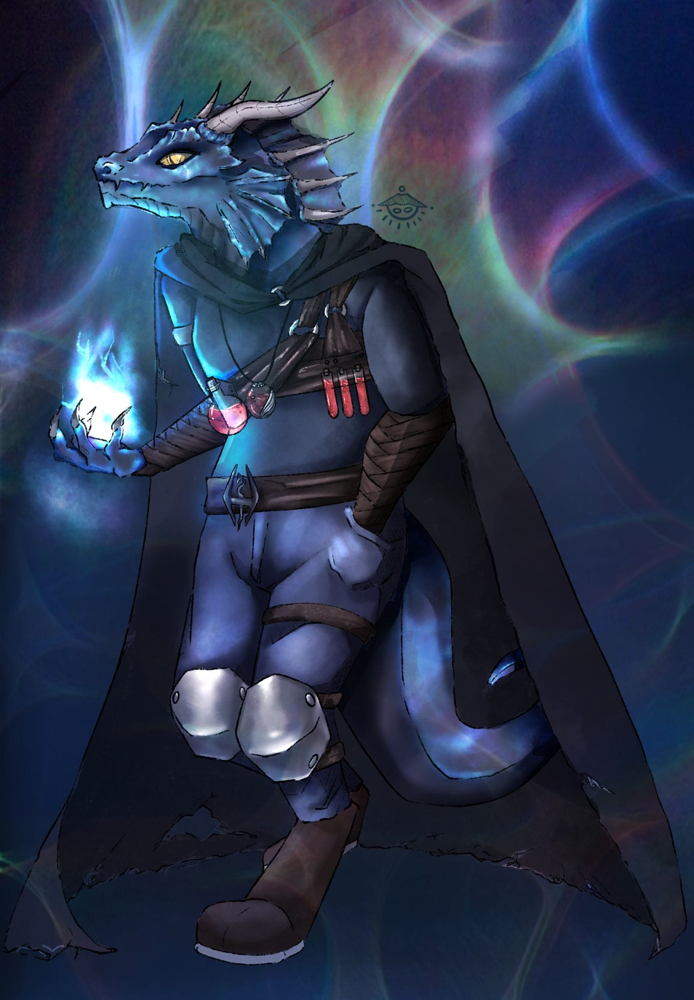

## Aitor Alarcón - Software & Engine Programmer

**Greetings!** I'm Aitor Alarcón, a developer and engineer residing in Spain, driven by perseverance and a deep passion for deciphering the true language of computing. As a final-year student pursuing a Double Degree in Computer Engineering and Video Game Design and Development, I combine the technical rigor of low-level programming with the creativity of interactive development to build innovative solutions.

## Skills and Expertise

I specialize in low-level programming, system architecture, and engine development. My proficiency spans languages such as **C/C++**, **C#**, **Java**, and **Python**, frequently working on performance analysis and optimization. I have a solid background in parallel computing (**OpenMP**, **GPU environments**), operating systems development, and distributed backend architectures, utilizing tools like **Docker Compose** and polyglot databases (**MongoDB**, **Neo4j**, **SQLite**).

## Innovation and Problem-Solving

I thrive on pushing hardware and software to their physical limits. Currently, I am applying my expertise in parallel computing to a research project focused on Continuous Collision Detection (CCD) within Unity. Whether it is implementing process scheduling and synchronization algorithms for an OS kernel (Minikernel), developing a UNIX command interpreter (MiniShell), or structuring the persistence layer of a server cluster, I approach each challenge as an opportunity to innovate and push my own technical boundaries.

## Community and Creativity

I view development not just as pure code, but as a collaborative and creative endeavor. My recurring participation in Game Jams and Hackathons has taught me to adapt quickly, taking on gameplay programming and technical asset creation roles under pressure. Furthermore, my work as a Technical Artist creating optimized textures for 3D environments.

## Continuous Learning

Computing is a path of endless self-discovery. My growth mindset drives me to never settle for merely using a tool, but to truly understand how it functions and communicates from its core. I am constantly searching for new architectures, design patterns, and paradigms to build systems that are more robust, scalable, and efficient.

## Collaboration and Communication

I firmly believe in the synergy of teamwork. Efficiency, leadership, adaptability, and responsibility are foundational to my work ethic. I value clear and structured communication to align technical vision with overall project objectives, ensuring success in both low-level developments and distributed applications.

## Get in Touch

Are you looking to maximize your systems' performance or build robust next-generation architectures? I'd love to connect with you! Feel free to reach out via a.alarorte.dragonborn@gmail.com or my LinkedIn profile for collaboration, consultation, or just a friendly chat about the fascinating world of low-level development and video games.

_Let's build something amazing together!_
