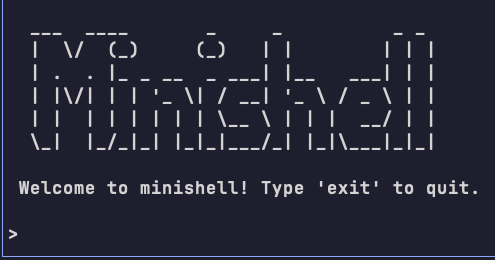

**Project Overview:**
This project consists of the implementation of a program designed to act as a command interpreter (Minishell), which is responsible for reading and executing commands directly from standard input. It was developed in group. 

## Design Objectives

The main objective of the code architecture was to ensure readability and maintainability. To achieve this, cluttering the `main` function was avoided, and the operational logic was delegated to specialized external functions, such as `funcionManejadora`, `eliminarJob`, `comandoCD`, `comandoJobs`, `comandoFG`, and `gestionarBackground`.

## Main Features

1. **Task (Jobs) and Process Management:**
   * The system declares a custom struct called `job`.
   * This struct stores critical data of the commands to be executed, including the original text line, the PIDs of all involved processes, and the total number of processes.
   * Global variables are used to manage the background jobs list, the size of this list, and the index of the job currently in the foreground.

2. **Redirections and Pipes:**
   * The interpreter is capable of dynamically creating the necessary processes and pipes.
   * It uses the `dup2` system call to correctly redirect standard inputs `<`, outputs `>`, and errors `>&` before executing the command with `exec`.
   * Rigorous error handling is included in all file operations to ensure safe execution.

3. **Background Execution:**
   * The shell checks whether a command belongs to the background (adding it to the task list) or the foreground (freeing the reserved PIDs after use).
   * The `gestionarBackground` function is executed right before returning the prompt to the user.
   * This function iterates over the jobs array checking if they have finished and applies `wait` to the terminated processes to correctly remove them from the list without hanging the system.

4. **Signal Management:**
   * Implements a `funcionManejadora` that overwrites the default behavior for the `SIGINT` and `SIGQUIT` signals.
   * This function prevents the minishell from closing accidentally.
   * It is responsible for killing all processes running in the foreground, while allowing background commands to ignore these signals.

5. **Custom Commands:**
   * **`cd`**: Changes the directory. If it receives no arguments, it redirects to the path defined in the `HOME` variable and always prints the current directory on the screen.
   * **`jobs`**: Prints all the commands saved in the background list along with their respective indices on the screen.
   * **`fg`**: Receives the index of a background command (shown by `jobs`) and brings it to the foreground.
   * **`exit`**: A custom command created specifically to exit the minishell, since the usual termination signals are blocked by design.

## Technology Stack

- **Programming Language:** ANSI C for rigorous low-level system programming and dynamic memory management[cite: 14].
- **Environment & OS:** UNIX/Linux ecosystem, leveraging POSIX APIs for direct operating system interaction[cite: 14].
- **Process & Signal Control:** Core system calls (`fork`, `exec`, `wait`, `pipe`, `dup2`) for concurrent execution, IPC (Inter-Process Communication), and low-level signal handling (`SIGINT`, `SIGQUIT`).
- **Parsing & Libraries:** Standard C libraries combined with a custom static parser library (`libparser.a`) to tokenize command-line inputs.

## Test Cases

The code was subjected to various tests to ensure its stability:
* Verification of chaining multiple commands using pipes, executing complex commands like `ls | tr 'r' 't' | wc`.
* Validation of the lifecycle of background processes, sending long processes to the background (e.g., `sleep 150 &`), listing them with the `jobs` command, and retrieving them to the foreground with `fg`.
